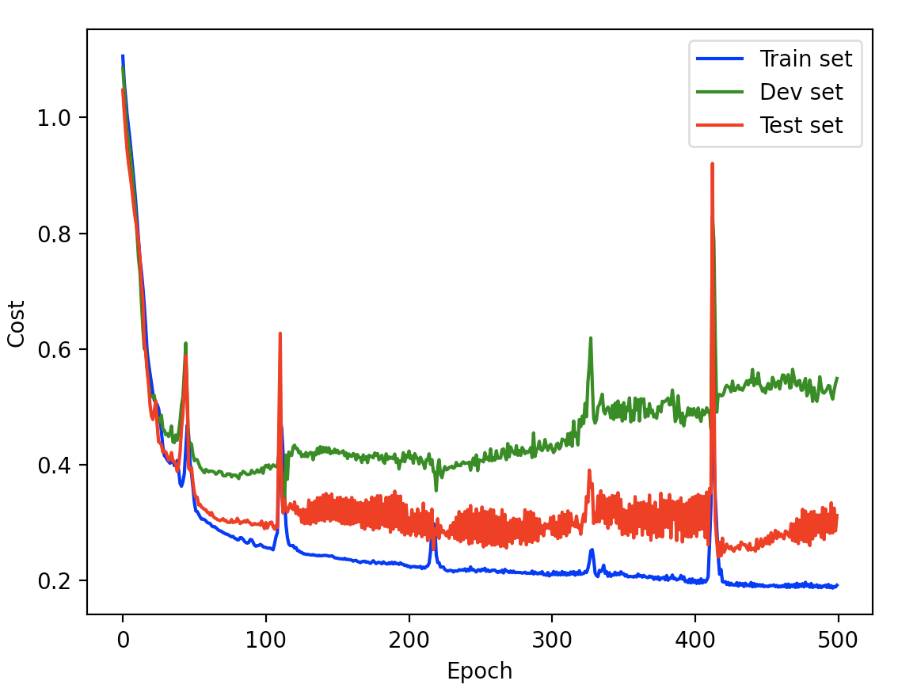
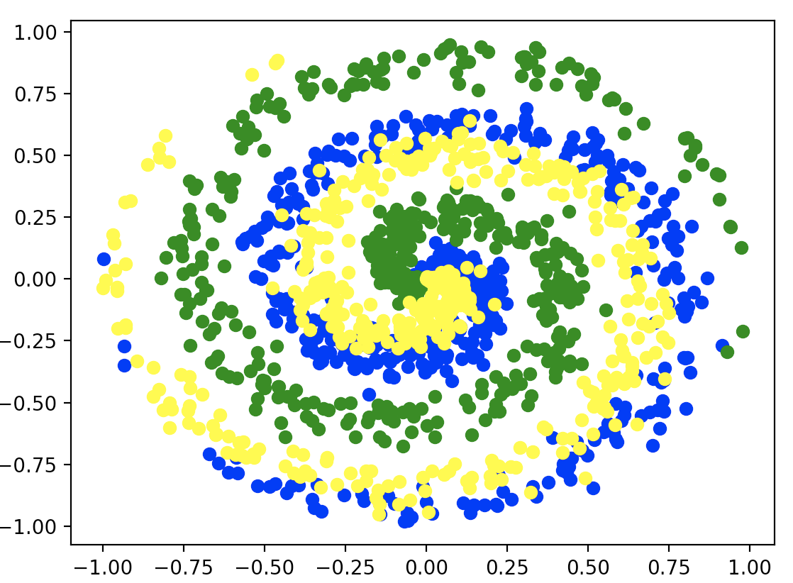

# Torchest
Pytorch tools and utilities (Trainers, data generators, functions, and more...)

# Trainers

One of the most common tasks you will do in pytorch is define training loops, which is a hassle because they are almost always the same. Torchest has trainers you can use for your projects

```python
from torchest.trainer import SimpleTrainer

# previous definition of model and data preparation
# train_dataloader = DataLoader(train_data)
# dev_dataloader = DataLoader(dev_data)
# test_dataloader = DataLoader(test_data)
# model = nn.Sequential(...)
...

"""
Prepare Trainer
"""
loss_fn = nn.CrossEntropyLoss()
learning_rate= 1e-2
optimizer = optim.Adam(model.parameters(), lr=learning_rate)

trainer = SimpleTrainer(model, loss_fn, optimizer)

"""
Train
"""
epochs = 500
trainer.train(data_train=train_dataloader, data_dev=dev_dataloader, data_test=test_dataloader, epochs=epochs)
```

Training loop progress

```
31%|██████████████████▍      | 156/500 [00:02<00:05, 58.01epoch/s, train_accuracy=76.2, train_cost=0.238290]
```

Trainer also saves the cost for the train, dev and test passes. You can simply call `trainer.plot_costs()` to display the graph with the costs




## Wandb visualization

 Trainers support [wandb](https://wandb.ai/) to visualize loss and acurracy as well as to save model versions. if you want to enable you have to set 2 parameters in your trainer initialization, `name` and `wandb`

 ```python
 trainer = SimpleTrainer(model, loss_fn, optimizer, name="MyProject", wandb=True)
 ```

 On the first run you will have to enter your API key, which you can obtain at https://wandb.ai/settings

# Data generators

## Spiral data

This will create a 2d matrix with points in a dataplot. Ideal for testing non-linearity in your network

```python
from torchest.datagen import spiral_datagen

class_num =  3
X, Y = spiral_datagen(450, class_num) # 450 elements per class
```


